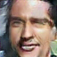

# PA5 Report
20160463 성해빈

training and test source codes, result outputs, and trained models are in google drive.  

https://drive.google.com/drive/folders/16Hw_PemDKYfd8rgNvh45-dLBsiC9WsGw?usp=sharing


# DC-GAN

I used https://github.com/pytorch/examples/tree/master/dcgan as the base of DC-GAN code.

I used https://www.kaggle.com/ashishjangra27/face-mask-12k-images-dataset/activity 's training set for the input of DC-GAN. 

I trained the dataset for 300 epoch.


This is the code that I used for extracting random samples.

```python
for i in range(999):
    noise = torch.randn(1, nz, 1, 1, device=device)
    fake = netG(noise)
    vutils.save_image(fake.detach(),
            'samples/image%d.png' % (i),
            normalize=True)
    np.save('samples/noise%d.npy' % (i), noise.cpu())
    print(i)
```


woah, some scary pictures. I guess I wouldn't need a scary movie for a year.


Now I check those random fake samples to decide which noise I would use for representing features.

Honestly, it's quite hard to find the picture that I want with so many weird pictures, but I picked ones that were most clear in human perspective.


I think this is quite a "man with mask". : `noise57.npy`


And this is "man without mask". `noise538.npy`



And this is woman with no mask. `noise512.npy`


And I make the result...

```python
man_with_mask = torch.from_numpy(np.load('samples/noise57.npy')).cuda()
man_no_mask = torch.from_numpy(np.load('samples/noise538.npy')).cuda()
woman_no_mask = torch.from_numpy(np.load('samples/noise512.npy')).cuda()

noise = man_with_mask - man_no_mask + woman_no_mask
fake = netG(noise)
vutils.save_image(fake.detach(),
            'generated.png',
            normalize=True)
```


WOW! this is quite amazing, since it actually looks like a woman with a mask! 

I wasn't expecting success, but I was quite surprised of it! This is fun!


I could see some interesting aspects while I was training.

This is the fake samples when epoch 100:


and this is the sample when epoch 300:


each of them are generated with same fixed noise.

What I could clearly see is that there are certainly some cases that more training leads to a worse generation. In fact, the more I train, I get more pictures that have lost contrast, became flat, and have too much noise, like the most left-bottom picture in the example. The reason I still used epoch 300 when I generated a woman without a mask was because it may have worse performance in the fixed noise as above, but it tended to have more consistency in the generated images in overall random noise. So the gradient descent mechanism wasn't just playing around, and I was able to pick images of my wanted feature more easily in epoch 300 model. 

DC-GAN is a model that has high stability using a deep convolutional approach of GAN. The amazing part of DC-GAN is that we can discover some semantics of what DC-GAN learned, and can perform vector arithmetic with those semantics and have some consistency. Even though DC-GAN performs very well in most situations and is the best model that works in GAN, the fundamental loss function is min-max, so it is quite hard to optimize, like we see in the example of epoch 100 and epoch 300 above, where some images get better and some don't.

I learned how a (DC-)GAN works. Although it didn't train as well as the clear images in some GAN examples, I could definitely verify the concepts. I studied it a lot of times in paper, but it was the first time to actually train it and perform vector arithmetic in noise to generate a specific feature we want. This experience was kind of fascinating, especially the vector arithmetic part.


# Paired img2img (cGAN)


## facade

I used code of https://github.com/junyanz/pytorch-CycleGAN-and-pix2pix .

First I do training and testing with facade dataset.


The results are quite impressive, since the fake image looks quite like a real image.

I learned what a cGAN can do with image translation. I think it's quite general in that it can cover any task that requires image translation, such as semantic segmentation, or even the other way like this example! 

If you look at the result carefully, you can see that the generated image usually lacks in image quality slightly, as it is more blurry than the original. Nonetheless, it seems quite convincing in many cases. IF the original translated image has some compromised parts, like some black part in the edges in facade dataset, then the translation of that part lacks quality very much. even so, we can see that it actually "remembers" that the label image had black parts, as we can see in the results.

cGAN works by "conditioning" the input on ordinary GAN. G(z) becomes G(x,z) and D(y) becomes D(y,x). The loss function has expectation on x also. This conditioning makes the generated image very close to our goal, leading to successful image translation model.  


## maps

For the next example, I used dataset of maps and aerial.

This is the result.


since the dataset didn't perfectly match the requirements of the code, I needed to generate a test set using a split of the training set. 

It had quite good quality, almost unable to tell if it is a fake, since aerial photos usually lack detail. One thing I notice is that the generated fake usually don't have so clean roads, since we didn't every tell them that the white line is a road.


# Unpaired img2img (cycleGAN)


## horse2zebra

I used code of https://github.com/junyanz/pytorch-CycleGAN-and-pix2pix.

First I do training and testing with horse2zebra dataset.


You could see that the results are not quite like the reference results of horse2zebra. This is probably due to insufficient training : it takes very much time to train a cycleGAN.  But fairly, I could see the results that are starting to have effect, in both zebra2horse and horse2zebra. You can see that there are some stripes left in the zebra2horse, and that gives us some insight of how the image changes as training proceeds. 

I learned the implementation details of a cycleGAN. We could actually see the real input, and the translation output, and the re-translation output. The model tries to make the re-translation and and real input similar, called cycle consistency loss. 

cycleGAN works by training both GANs that make X->Y and Y->X, and including cycle consistency loss in the loss function. One of cycleGAN's best advantage is that we don't need to provide "paired" data, and this acts as a very good advantage of getting datasets. Another advantage is that we automatically get a reverse translation.


## vangogh2photo

For the next example, I used dataset of vangogh and photos.


Although I didn't train this model very much, the translation from real image to vangogh certainly looks like a drawing. You can see that the model tends to add some noise in colors, just like what vangogh does. We can see that the photo -> drawing translation could be understood as some shading on object borders, and addition of some consistent noise.

